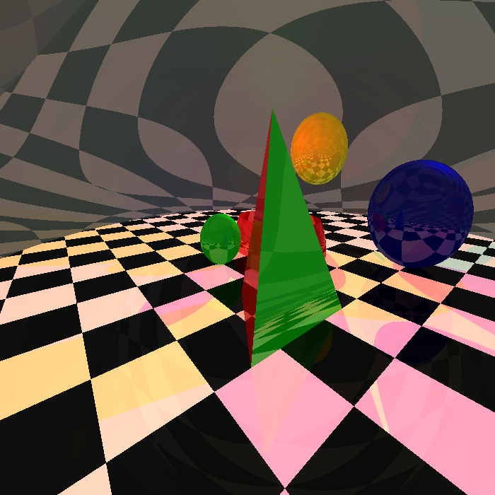
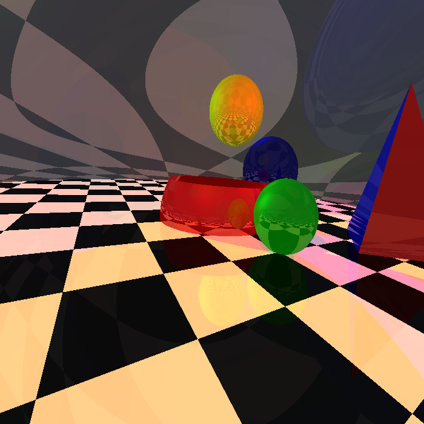
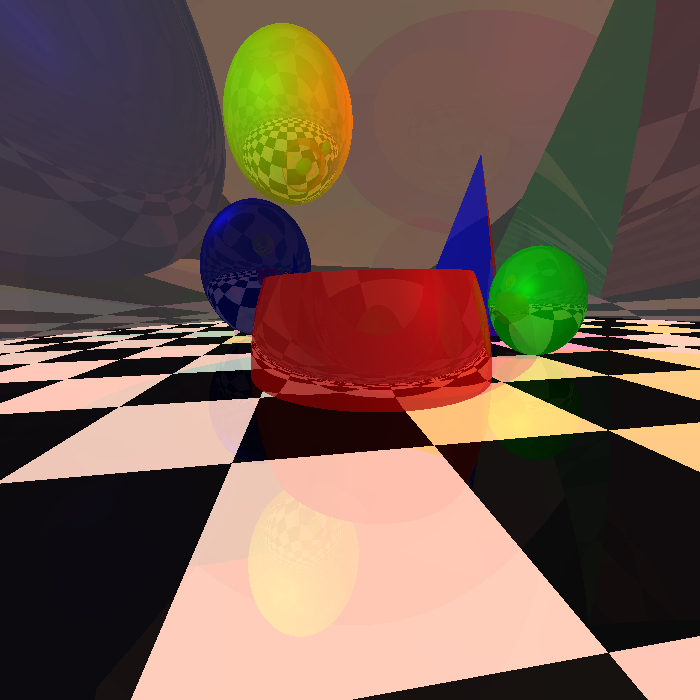
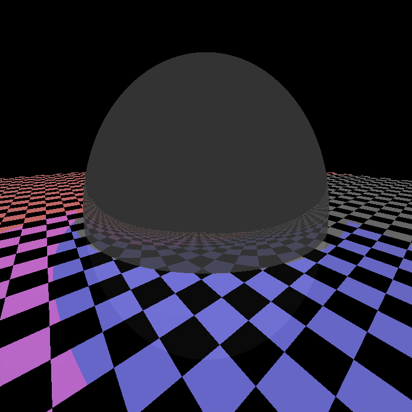
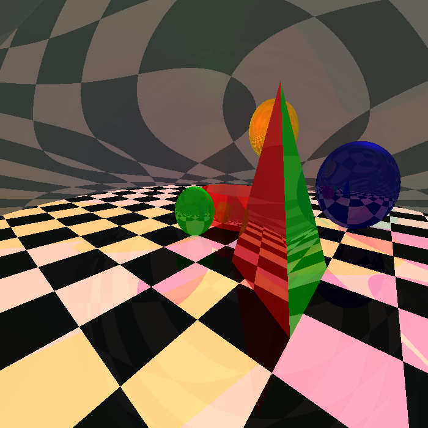

# Ray Tracer in C++ and OpenGL

A recursive ray tracer written from scratch in **C++**, with an interactive **OpenGL** viewer for moving the camera around the scene. It renders spheres, triangles, general quadric surfaces and a checkerboard floor, lit by point lights and spotlights, with **Phong shading**, **shadows** and **recursive reflections**. Each rendered frame is saved as a bitmap image.

Built as part of the **CSE 410: Computer Graphics Sessional** coursework.

<p align="center">
  
  
  
</p>

---

## Features

- **Primitives:** spheres, triangles, general quadric surfaces and a checkerboard floor.
- **Lighting:** point lights, and spotlights with a direction and a cutoff angle.
- **Phong illumination:** ambient, diffuse and specular components, with a per-object shininess exponent.
- **Shadows:** a surface point is lit by a light only if nothing blocks the path between them.
- **Recursive reflections:** reflected rays are traced up to a configurable depth, so objects reflect each other and the floor.
- **Interactive camera:** fly around the scene in the OpenGL preview, then render the current view with one key press.

---

## How It Works

### Casting Rays

When a capture is triggered, the renderer places a virtual image plane in front of the camera. Its distance comes from the field of view:

$$d = \frac{H/2}{\tan(\text{fov}/2)}$$

The plane is divided into an `N × N` grid, where `N` is the image resolution from the scene file. For each pixel, a ray is cast from the camera through the center of the grid cell. The ray is tested against every object, and the closest hit determines the pixel color.

### Ray-Object Intersection

| Object | Method |
|---|---|
| Sphere | Solves the quadratic formed by substituting the ray into the sphere equation |
| Triangle | Solves for the barycentric coordinates and the ray parameter together with Cramer's rule, and keeps hits that fall inside the triangle |
| General quadric | Solves the ray against $Ax^2 + By^2 + Cz^2 + Dxy + Exz + Fyz + Gx + Hy + Iz + J = 0$, then clips hits outside the optional bounding box |
| Floor | Intersects the $z = 0$ plane within the floor's bounds and picks a black or white tile color from the hit position |

### Shading

At each hit point, the color starts from the ambient term, then each light adds its contribution:

- **Point lights:** a shadow ray is cast from the light to the point. If no object blocks it, the light adds diffuse (Lambert) and specular (Phong) terms.
- **Spotlights:** same as point lights, but only if the point lies inside the light's cone, meaning the angle between the light direction and the point is within the cutoff angle.

### Reflections

If the recursion level allows, a reflected ray is cast from the hit point in the mirror direction, starting slightly off the surface to avoid hitting the same point again. Its color is scaled by the object's reflection coefficient and added to the result. This repeats until the maximum recursion depth set in the scene file.

---

## Controls

Move the camera in the preview window, then press `0` to render the view.

| Key | Action |
|---|---|
| `0` | Render the current view and save it as a `.bmp` image |
| `↑` / `↓` | Move forward / backward |
| `←` / `→` | Move left / right |
| `Page Up` / `Page Down` | Move up / down |
| `1` / `2` | Look left / right |
| `3` / `4` | Look up / down |
| `5` / `6` | Tilt clockwise / counterclockwise |
| `Esc` | Exit |

---

## Scene File Format

The scene is loaded from `scene.txt`:

```
4                         # recursion level (reflection depth)
700                       # image resolution (700 × 700 pixels)

9                         # number of objects
sphere
40.0 0.0 10.0             # center
10.0                      # radius
0.0 1.0 0.0               # color (R G B)
0.4 0.2 0.2 0.2           # ambient, diffuse, specular, reflection coefficients
10                        # shininess

triangle
50 30 0                   # vertex 1
70 60 0                   # vertex 2
50 45 50                  # vertex 3
1.0 0.0 0.0               # color
0.4 0.2 0.1 0.3           # coefficients
5                         # shininess

general
1 1 1 0 0 0 0 0 0 -100    # A B C D E F G H I J
0 0 0 0 0 20              # reference point, then length, width, height (0 = unbounded)
0.0 1.0 0.0               # color
0.4 0.2 0.1 0.3           # coefficients
10                        # shininess
...

6                         # number of point lights
70.0 70.0 70.0            # position
1.0 0.0 0.0               # color
...

3                         # number of spotlights
10 10 -20                 # position
0 1.0 0.0                 # color
0 0 1                     # direction
12                        # cutoff angle (degrees)
...
```

The checkerboard floor is added automatically.

---

## Repository Structure

```
Ray-Tracing/
├── 1905098_main.cpp            # Scene loading, camera controls, ray casting and image capture
├── 1905098_classes.h           # Vector math, rays, lights and all object types with intersection and shading
├── 1905098_bitmap_image.hpp    # Bitmap image library for saving renders
├── scene.txt                   # Scene description
└── screenshots/                # Sample renders
```

---

## Getting Started

### Prerequisites
- A C++ compiler (g++)
- OpenGL and GLUT (freeglut)

### Build and Run

**Linux:**

```bash
sudo apt install freeglut3-dev
g++ 1905098_main.cpp -o raytracer -lGL -lGLU -lglut
./raytracer
```

**Windows (MinGW):**

```bash
g++ 1905098_main.cpp -o raytracer.exe -lfreeglut -lopengl32 -lglu32
raytracer.exe
```

Run the program from the folder containing `scene.txt`. Rendered images are saved in the same folder as `Output_11.bmp`, `Output_12.bmp` and so on.

---

## Sample Renders

| | | |
|---|---|---|
|  |  |  |
|  |  | |
